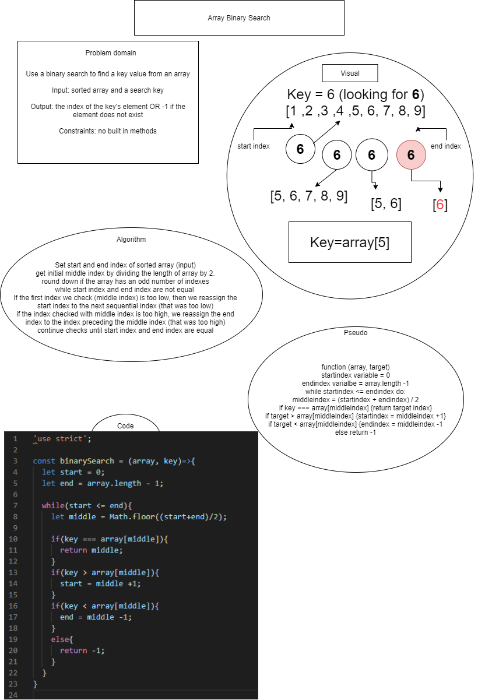

# Reverse an Array
Resolved by Ricardo Barcenas

## Challenge
Write a function called BinarySearch which takes in 2 parameters: a sorted array and the search key. Without utilizing any of the built-in methods available to your language, return the index of the array’s element that is equal to the search key, or -1 if the element does not exist.

## Approach & Efficiency
set start and end index
check middle index to equal key
if key is greater, set start to i+ of middle index checked
if key is less than, set start

## Solution

- [Array Binary Search](array-binary-search.js) 

