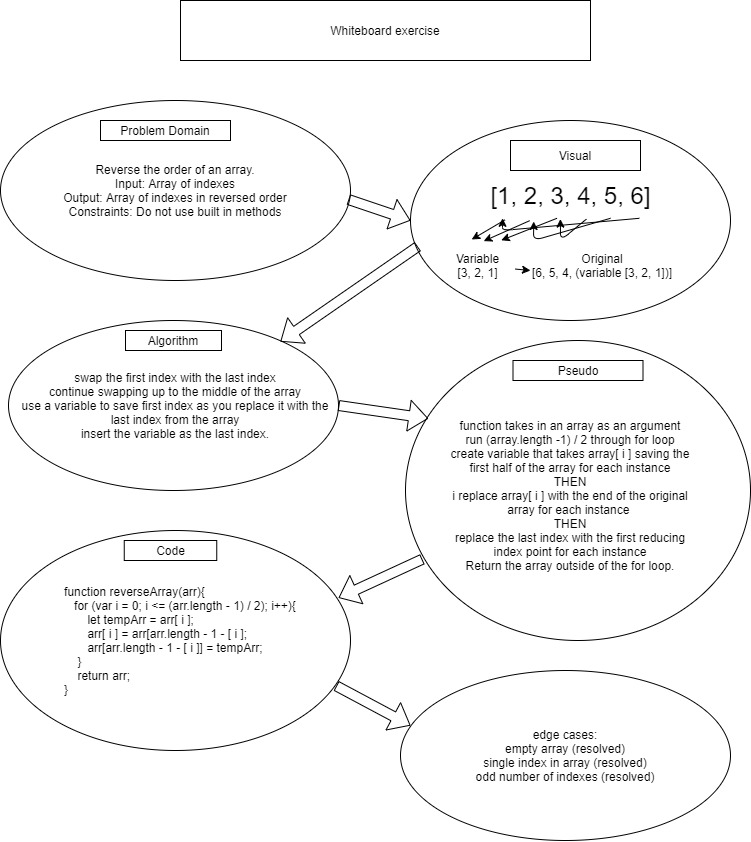

# Reverse an Array
Resolved by Ricardo Barcenas

## Challenge
Write a function called reverseArray which takes an array as an argument. Without utilizing any of the built-in methods available to your language, return an array with elements in reversed order.

## Approach & Efficiency
swap the first index with the last index
continue swapping up to the middle of the array
use a variable to save first index as you replace it with the last index from the array
insert the variable as the last index.

## Solution

- [Array Reverse js](array-reverse.js) 

