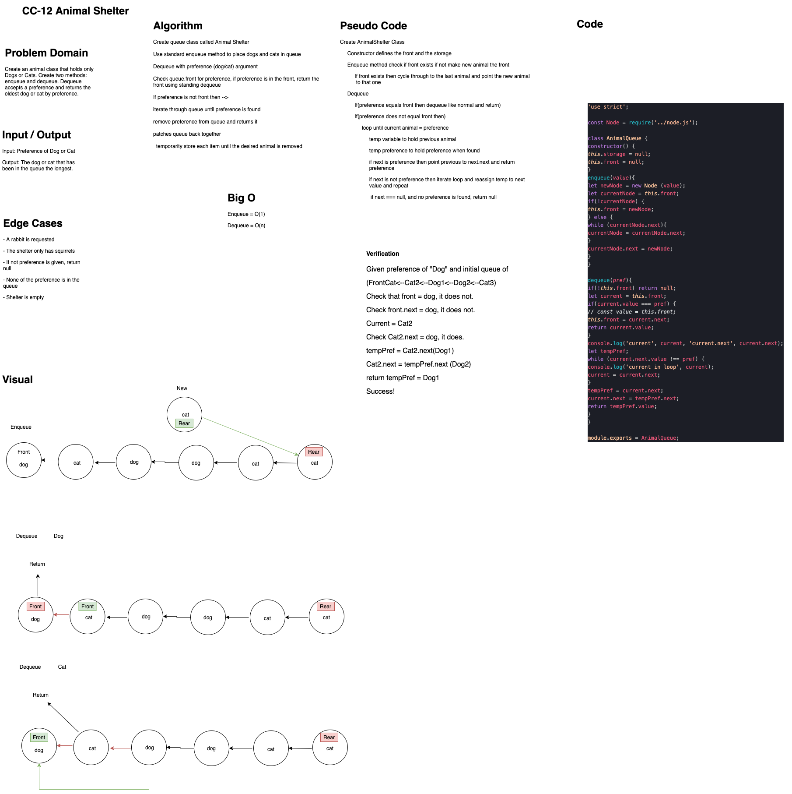

# Challenge Summary
First-in, First out Animal Shelter.

## Challenge Description
Create a queue that takes a preference(argument) of dog or cat. enqueue an animal(dog/cat) adds animal to the end of the line. dequeue a preference(dog/cat) to have the oldest in queue of the preference.

## Approach & Efficiency
create que class
use enqueue method to place dogs/cats in queue
dequeue with preference as argument
iterate through queue to find preference
remove preference from queue and return it
patch queue back together

## Solution

- [Animal Shelter Queue](fifo-animal-shelter.js) 

