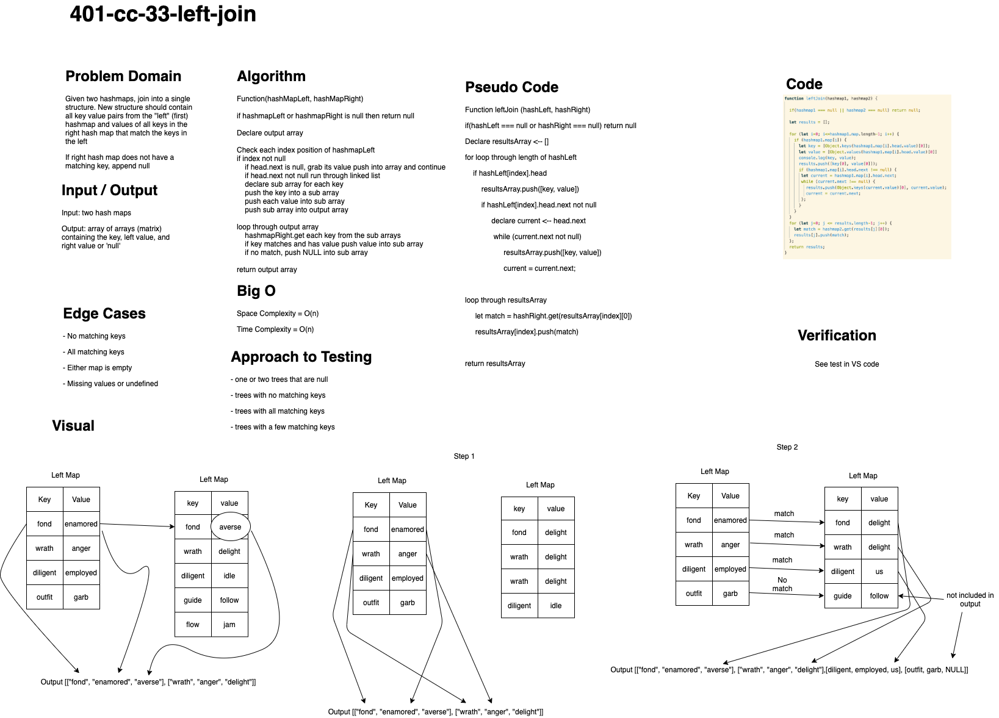

# Left join

## Resolved by: 

    Simon Panek, Nathan Rhead and Ricardo Barcenas

---
## Challenge
    Write a function that accepts two hashtables, joins them with the left keys. If the key does not exist in the second hashtable, insert null as a value to the left value. If the right hashtable has a key that the right does not, it is ignored. Returns a matrix with each key and values in their own array.
---
## Approach & Efficiency

    loop through first hashMap pushing keys and values into arrays

    match hash index from hashMap2, if match push into results

---

    Big 0

    Space and Time = O(n)

---
## Solution

- [Left Join](left-join.js) 

