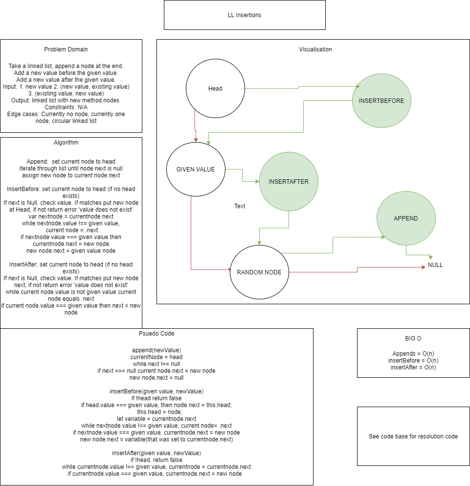
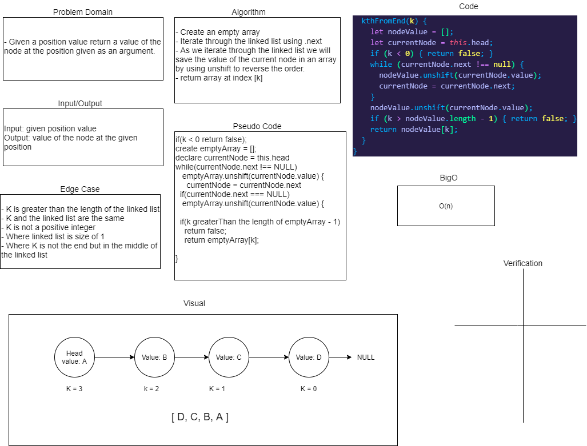

# Linked-list

## Challenge

## **Challenge 05:**

Create a class that will allow creation of new nodes, search for matching contents and a string of the generated list.

Resolved by: Ricardo Barcenas

### Approach & Efficiency

## **Challenge 06:**

Create methods that will allow the creation of new nodes at then end of a linked list, before a given value and after a given value.

Resolved by: Simon Panek and Ricardo Barcenas

### Approach & Efficiency

append: iterate through list to find null. assign new node to current node.next

insertBefore: set next node to variable, iterate through list to find next to equal given value, set currentnode.next to new node, set  new node.next to saved variable next.

insertAfter: iterate list to find given value, assign current node.next to new node when given value is found.

## **Challenge 07:**

Given a position value, return the value of the not at the position given as an argument.

Resolved by: Stacy Burris, Simon Panek and Ricardo Barcenas

### Approach & Efficiency

Iterate through the linked list, saving the values of current nodes into an array with unshift, returning the value of the node at the given position

## API

insert() - Inserts new node at beginning of linked list making whichever value that was added last, the head and pointing to the value that was previously head.

includes() - Checks to see if a value exists within the linked list and returns either true or false.

toString() - Returns the elements found in a linked list as a string.

append() - append a node at the end of a linked list

insertBefore() - add a new node before the node of a given value

insertAfter() - add a new node after the node of a given value

kthFromEnd(k) - return value of node at position k

## Solution

- [Linked List](linked-list.js) 

