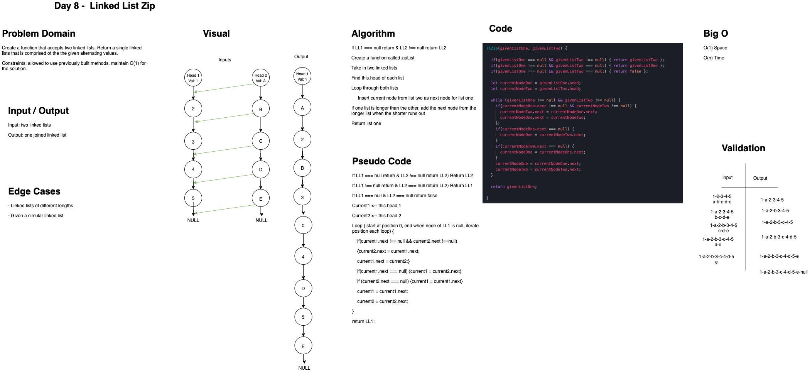

# LL Zip

Resolved by Stacy Burris, Simon Panek and Ricardo Barcenas

## Challenge
Write a function that accepts two linked lists as arguments. Return a single linked list that is comprised of the given alternating nodes.

## Approach & Efficiency

Make LL2.next equal LL1.next then make LL1.next LL2 current through a loop.

## Solution

- [LL Zip](ll-zip.js) 

