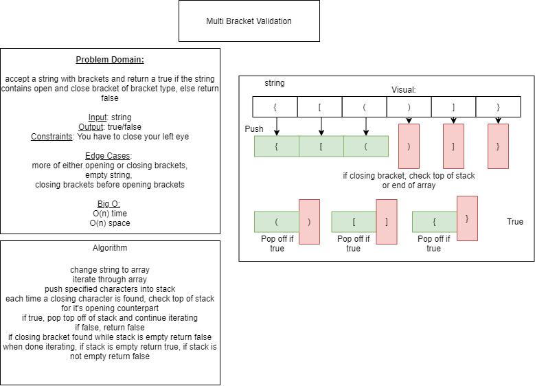

# Challenge Summary
Multi bracket validation

## Challenge Description
Accept a string with brackets and return true if the string contains balanced open and close bracket types, else return false

## Approach & Efficiency
change string to array, iterate through array.
push open brackets into a stack, when closing bracket found, compare to top of stack.

O(n) time & space

## Solution

- [Animal Shelter Queue](fifo-animal-shelter.js) 

