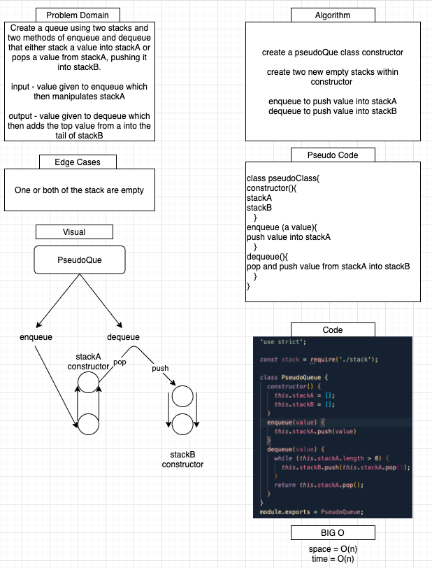

# Queue with Stacks

Resolved by Mariko Alvarado, Nathan Cox, Simon Panek and Ricardo Barcenas

## Challenge
Create a PseudoQueue class that uses 2 stack objects.

## Approach & Efficiency

Make stacks arrays

## Solution

- [Queue with Stacks](queue-with-stacks.js) 

