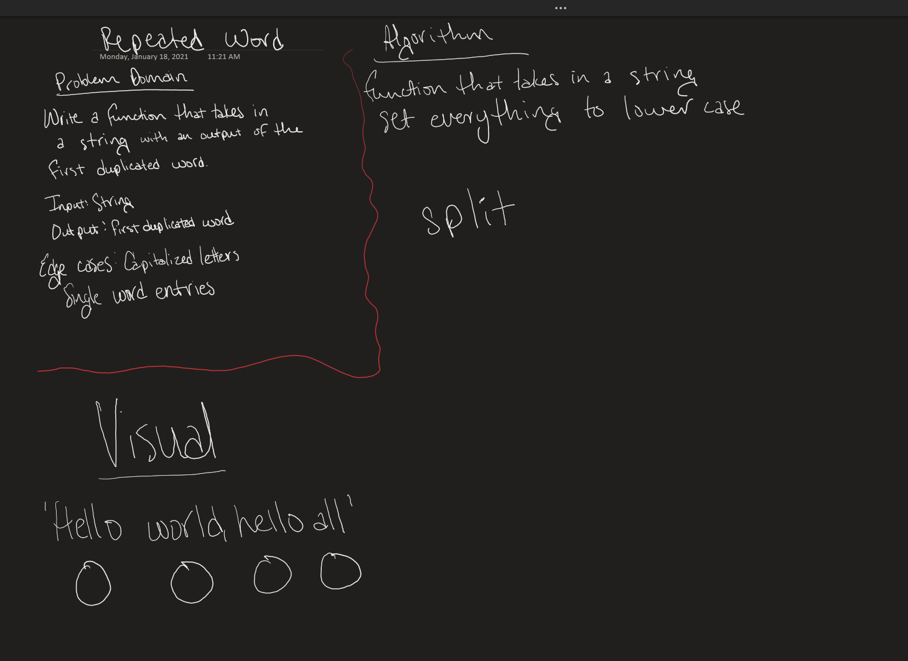

# Repeated Word

Resolved by Mariko Alvarado, Simon Panek and Ricardo Barcenas, Nathan Rhead

## Challenge
Write a function that accepts a string and returns the first repeating word.

## Approach & Efficiency

## Solution

- [Repeated Word](repeated-word.js) 

