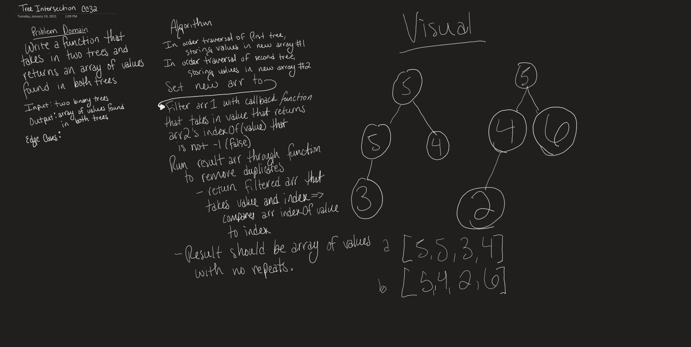

# Tree Intersection

Resolved by Mariko Alvarado, Simon Panek and Ricardo Barcenas, Nathan Rhead

## Challenge
Write a function that accepts two binary trees and returns a set of values found in both trees.

## Approach & Efficiency

store values in arrays, filter arrays into single array, filter 3rd array to remove duplicates.

## Solution

- [Tree Intersection](repeated-word.js) 

